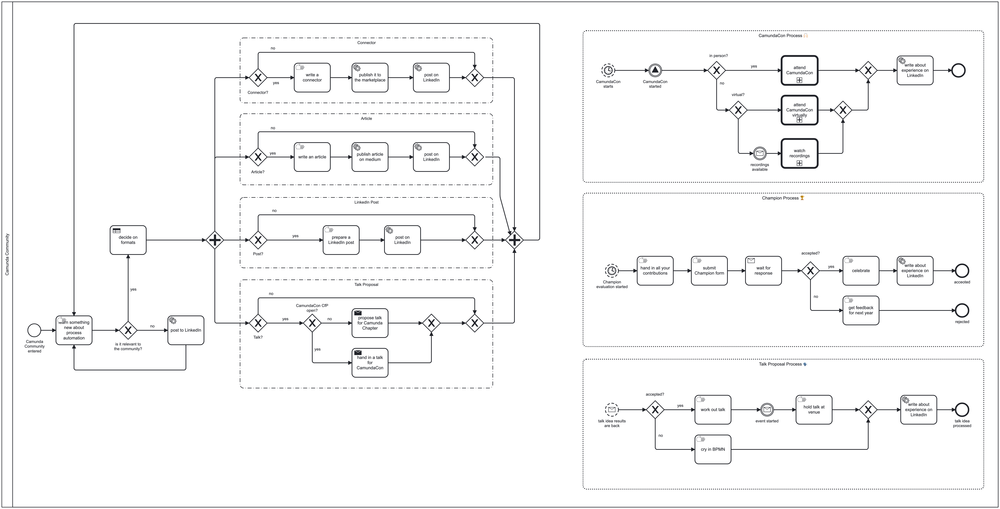

# 🏆 Camunda Champion Process

A BPMN model to describe my champion activities in a rather funny way.

## Description

If you wonder how I plan or implement my Camunda Champion activities, you can take a look at the process model

If you have any questions about the program, check out the [Camunda Champion Program Q&A](https://camunda.com/developers/champions/)
